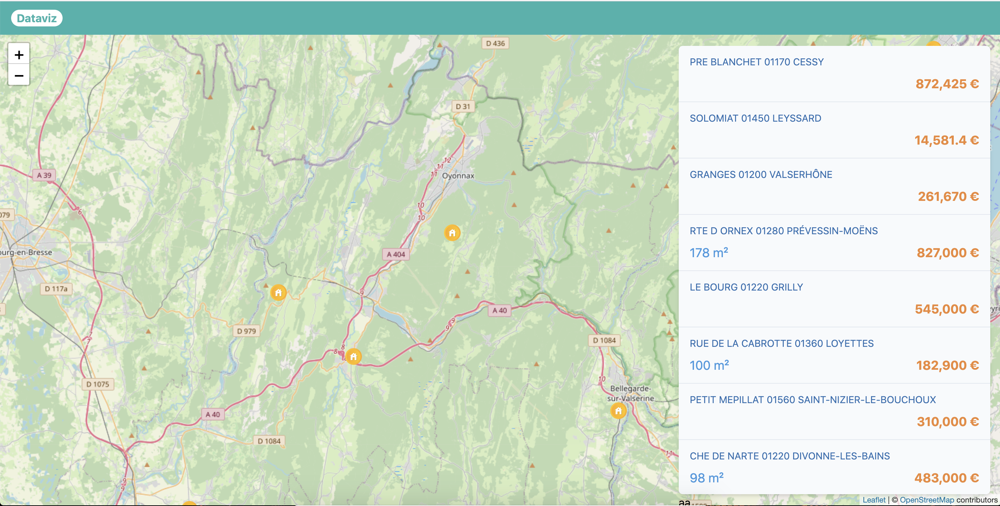

> For confidentiality reasons, please do not fork this repository from GitHub. Create a new private repository on your account.

Hi 👋
---

This is a practicing exercise about both backend and frontend Javascript.

This is supposed to last approximately 2 hours for experimented Node and React developers.

Thank you for taking the time to make it. We appreciate it.

# Goals

This exercise is the occasion for you to

- Give us an overview of your **thinking**
- Demonstrate the cleanliness of your code and your **ability to work on a shared codebase** (incl. naming, file structure, and code style)
- Show us how you **make sure that everything works well in production** (incl. QA, unit tests, a bit of defensive programming...)
- Showcase how you would **package the app and distribute it** to users
- Maybe learn tools you don't know yet
- Have this work as a support to discuss technical topics

# About

This is a simple fullstack application that shows a list of estates on a map.
It uses React for the frontend and Apollo for the backend, with some data stored in MongoDB.

# Getting started

1. Go to `backend/` and run `docker up -d`
1. Go to `backend/` and run `yarn install`, then `yarn start`
1. In a new terminal, go to `frontend/` and run `yarn install`, then `yarn start` 
1. From `backend/`, seed data in mongodb by running `docker-compose run seed`

You should get:
- The frontend app on http://localhost:3000
- The Apollo UI on http://localhost:4000
- The MongoDB admin on http://localhost:8081

# Types generation

On the backend, you should be able to generate the Typescript types from the GraphQL schema by running `yarn run graphql:codegen`

For the frontend, you can do the same to generate the queries types. Note that the backend should be running, because the schema is fetched to perform the generation.

# Work to do

We'd like you to pick some improvements or new features, based on the skills you'd like to show us.
**Please pick 2 things on different topics, try to spend around 2 hours of work on this project**
If you have ideas of improvements that are not on this list, you can improvise too.

**Suggested tasks:**

- [ ] Add some authentication (a - login screen and some - authentication on the backend)
- [ ] Be able to sort the estates - by price or surface
- [ ] Add pagination to the list
- [ ] Load the estates as we move - on the map
- [ ] Put everything in a docker - container image
- [ ] Add redux to the frontend - app
- [ ] Synchronize the data with - an elasticsearch instance and - request it instead of mongodb
- [ ] Write some acceptance tests - (for example with Cypress)
- [ ] Make the backend use an - Apollo DataSource
- [ ] Add a form to create a new - estate
- [ ] Import some point of - interests (schools, bus stops...- ) from the governemental open - data
- [ ] Make the app a Progressive - Web App that works offline
- [ ] Find an estate on the map - by clicking on it on the list - - and vice versa
- [ ] Add some Jest unit tests

# Any question ?

If some points aren't clear to you, no worries we can have a quick chat.
Send me an email at maxime@scoppe.fr.

# When you're done

Share your repository with @maximelebastard on GitHub and drop an email to maxime@scoppe.fr.